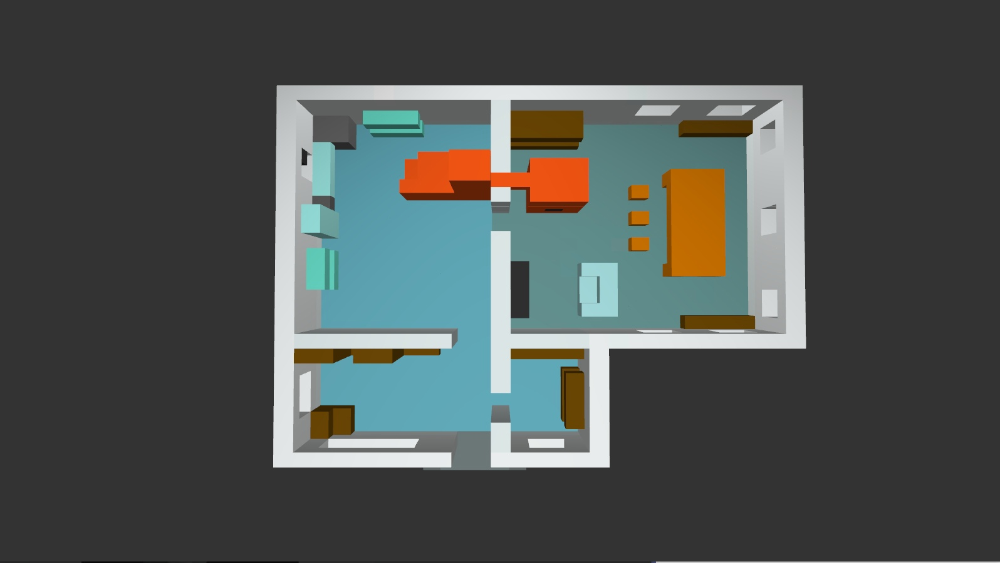
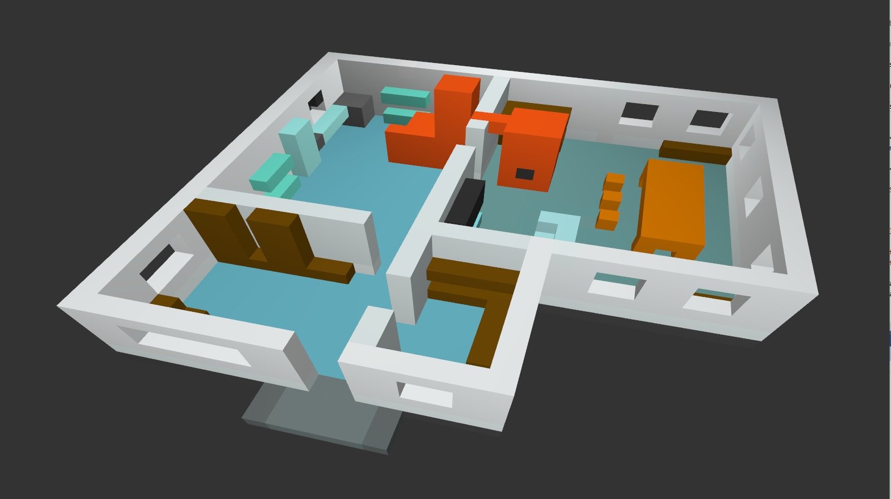
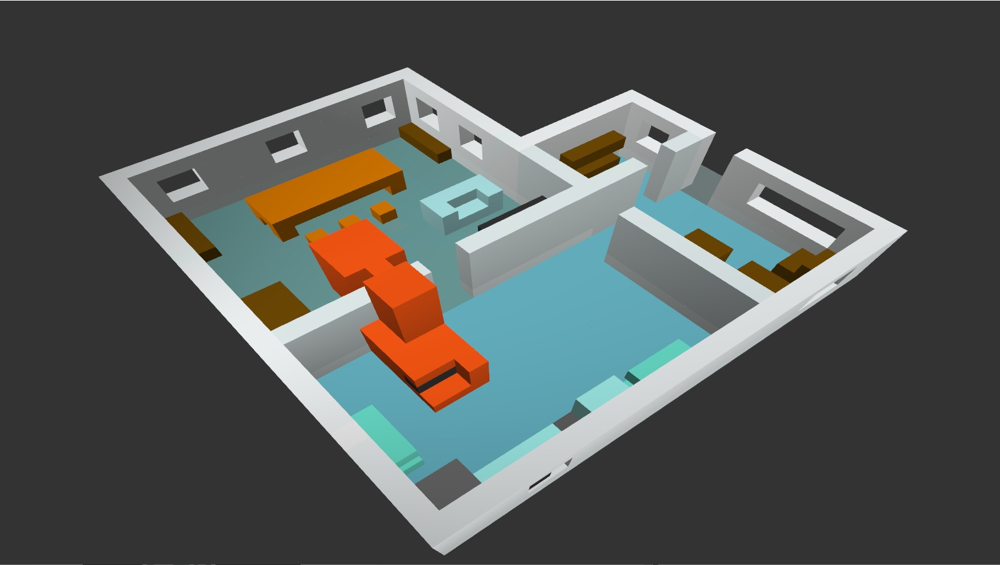

# Voxelus

*Voxelus* is a 3d voxel editor that was created for fun.

OpenGl wrappers created. Batch renderring support. Basic ECS system was implemented.

## Some render examples

## TODO:
Separate Voxelus and TypoEngine. TypoEngine should be a dll linked to the Voxelus.

### TypoEngine
Add different scenes support.
Move material logic to MaterialComponent fully.
Update batch rendering support.
Add occlusion culling support.
